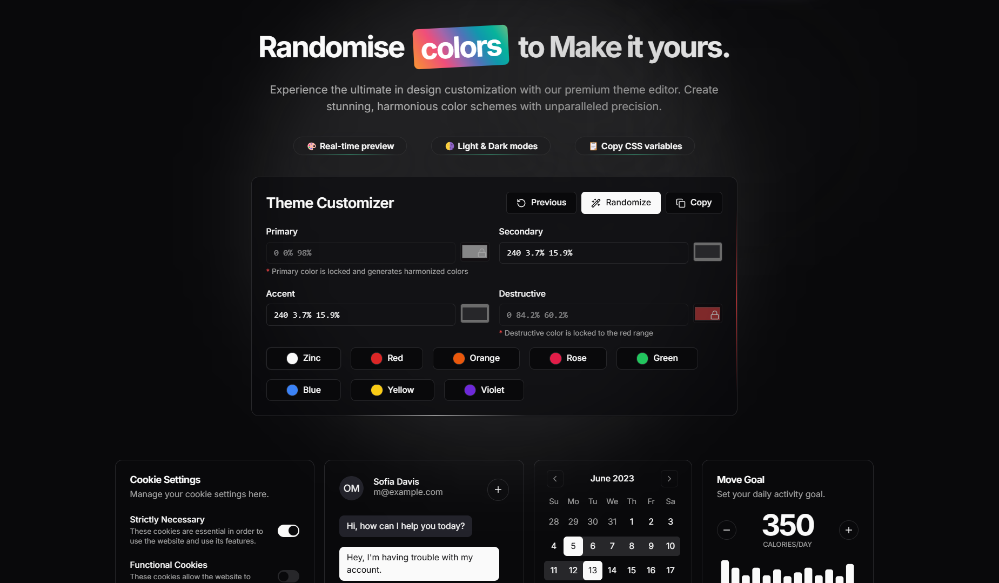
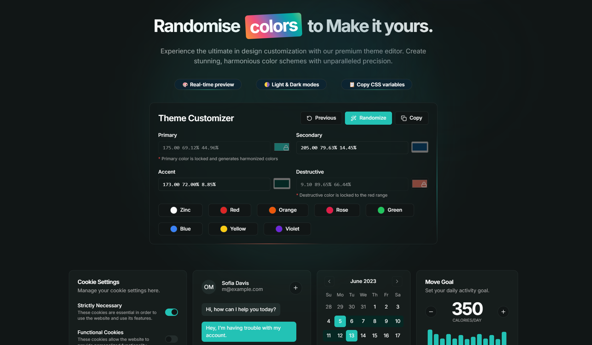

# ShadCN Theme Generator 🎨

A unique and intuitive theme generator for ShadCN UI, offering perfectly harmonized color palettes with real-time previews.

## 🚀 Features

- 🎨 **Randomized Harmonized Themes** - Generates themes where all primary, accent, secondary, muted, and foreground colors are in harmony.
- 🟥 **Structured Destructive Colors** - Ensures all destructive colors belong to the red spectrum.
- 🎛 **Smart Manual Selection** - Provides the best possible harmonized colors based on the chosen primary color.
- ⚡ **Real-time Preview** - Instantly see how the theme looks in both light and dark modes.
- 🌗 **Light & Dark Modes** - Toggle between modes effortlessly.
- 📋 **Copy CSS Variables** - Get the generated CSS variables instantly for easy integration.

## 🎯 Why is it Unique?

Unlike traditional theme generators, this tool ensures:

- Every color in the palette complements the others.
- Destructive colors always remain within the red spectrum for consistency.
- Even in manual selection, the chosen primary color intelligently dictates the best harmonized shades.

## 📸 Preview

## 🔥 Usage

Simply tweak the settings, generate your theme, and copy the CSS variables to use them in your project!

---

🚀 **Start designing beautiful themes effortlessly!**

## Author

- Subhadeep Roy ([Twitter](https://x.com/mvp_subha))